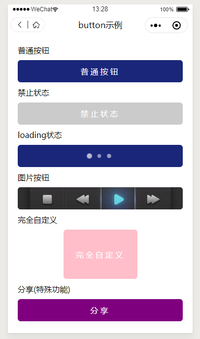

## 示例图片


## 示例代码

普通按钮
```html
    <better-button onTap='btnTap' params="{{ex_pa}}"></better-button>
```
禁止状态
```html
    <better-button text='禁止状态'  disabled></better-button>
```
loading状态
```html
    <better-button text='loading状态' loading></better-button>
```
图片按钮
```html
    <better-button  image='/assets/imagebtn.png'></better-button>
```
完全自定义
```html
    <better-button text='完全自定义'  
        custom='{{style}}'
    ></better-button>
```
```js
let style = {
    'background-color':'pink',
    'width':'300rpx',
    'height':'200rpx'
}
```
## 属性

|属性|类型|默认值|必填|说明
|:---:|:---:|:---:|:---:|---|
|text|String|普通按钮|否|按钮上显示的文本|
|disabled|Boolean|false|否|是否显示禁止状态|
|image|String||否|若有图片地址 则显示为图片按钮|
|loading|Boolean|false|否|是否显示loading状态|
|custom|Object||否|自定义的css|
|options|Object||否|button按钮的特殊参数|
|options.openType|String||否|等同于button的open-type参数|

## 方法

### onTap

>点击事件

#### 示例

```html
    <better-button onTap='btnTap' params="{{ex_pa}}"></better-button>
```
```js
  btnTap(e){
    let {params} = wx.$.get(e);
    wx.showToast({
      title: '点击了 参数是：'+params.text,
      icon: 'none'
    })
  },
```